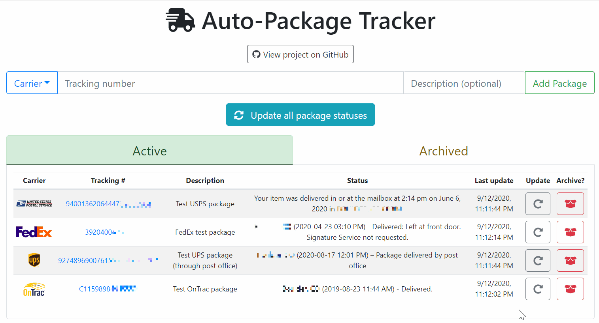
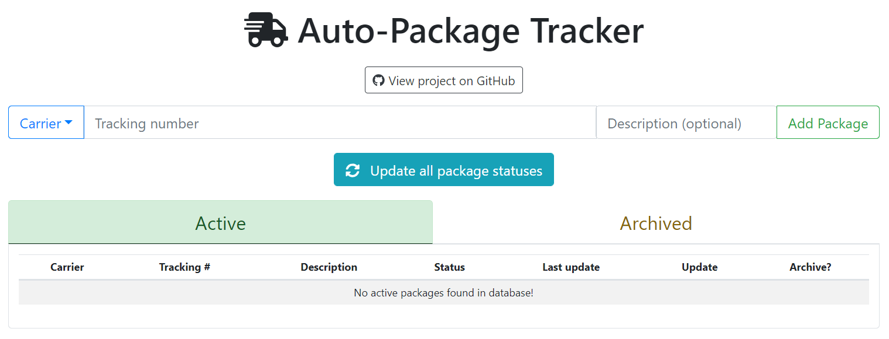

# Self-hosted package tracking



This is a simple app using MongoDB, Express.js, React, and Node to allow a user
to create _package_ records and fetch their status from the carriers' APIs
(or scraping, sometimes).

It requires access to the carriers' API tools, which differs a bit for each carrier. The
following links have more information on how to create accounts and get credientials.

### Tracking APIs:

USPS: 
  - https://www.usps.com/business/web-tools-apis/track-and-confirm-api_files/track-and-confirm-api.htm#_Toc41911503
  - Sign up here (free): https://www.usps.com/business/web-tools-apis/documentation-updates.htm

UPS: 
 - https://www.ups.com/upsdeveloperkit/
 - Sign up here (free, but need a UPS account with payment method attached): https://www.ups.com/upsdeveloperkit/announcements

Fedex: 
 - Becuase of issues with the API, Fedex package status is obtained by scraping the public website
   (which is a little bit slower), so no API credentials are needed. 
   [Playwright](https://github.com/microsoft/playwright) is used for the scraping.

OnTrac: 
 - Becuase of issues getting access to the API, OnTrac package status is obtained by 
   scraping the public website, so no API credentials are needed.

## Initial setup

The project is built using Node, and so can be run (with a few modifications) by using
the standard `npm start` approach (check the `package.json` files for more details about
the scripts that it uses).

Since there are a couple moving parts however, it is easier to get up and running using
[Docker](www.docker.com) (specifically, [docker compose](https://docs.docker.com/compose/)).
The `docker-compose.yml` file specifies three containers that will communicate with each
other to run the app: a MongoDB database for data storage, a Node/Express server that 
does the API checks/scraping, and a React client application that you interact with in
the browser.

### Clone or download the project using git:

```sh
$ git clone https://github.com/jat255/package_tracker.git
$ cd package_tracker
```

Once this has downloaded, rename the `.env.example` file to `.env`, and replace the values 
indicated with ones that make sense for you. The two API credentials you obtained for
UPS and USPS, and then the username and password for the MongoDB instance you will create
(can be anything, they don't _really_ matter).

### Build the Docker images and run the app

From the cloned folder, you should be able to run the app with one command:

```sh
$ docker-compose up --build -d
```

The first time this is run, it will take quite some time, since it will go through
and build the three docker images (and the server requires a number of dependencies
since `playwright` uses a headless version of Chromium for scraping). The `-d` flag
tells Docker to detach after bringing up all the containers. `--build` tells it
to build (or rebuild) the containers. Assuming all went well,
the app should be running in the background and should be accessible in your web
browser at http://localhost (or perhaps a different port if you changed it in
`docker-compose.yml`).

To view the logs of the application, check the browser console (for the client), or
run the following to see logs from each container in the app stack:

```sh
$ docker-compose logs --follow
```

To shut down the containers, run:

```sh
$ docker-compose down
```

The application data is stored in a [docker volume](https://docs.docker.com/storage/volumes/),
so to clear the app's data, you'll have to use docker tools. First find a list of the 
existing volumes using:

```sh
$ docker volume list
```

Then to remove the `dbdata` volume:

```sh
$ docker volume rm package_tracker_dbdata 
```

### Using the app

When you visit the app for the first time, there will be no packages in the system, so
the display will be empty:



To add a package to the tracker, select the
correct carrier from the dropdown, paste the 
tracking number into the appropriate box, add a
description (if desired), and click the "Add 
Package" button (or press enter).

The package will show up in the table below, and
the app will immediately try to update the status
of the package. 

To update an individual package's status, click
the gray update button to the the right of the
table. Trackers using the scraping method (FedEx
and OnTrac, currently) will be significantly
slower than the direct API methods, unfortunately.
Be patient, and they should finish updating.


To update all packages at once, click the blue
button above the table. The button will show
the progress of the operation to give an indication
of how many packages are left to track.

To stop tracking a package, click the red 
"archive" button for that package. The 
package will be moved to the "Archived" tab,
and will no longer be included in any updates.